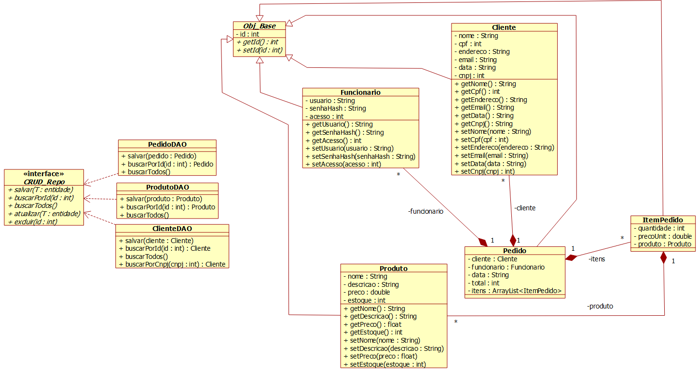

# Sistema desktop de gestão comercial em Java
Aplicação completa desenvolvida em Java (Desktop/Swing/JavaFX) para gerenciamento de um sistema comercial. O programa inclui um módulo de Login e Autenticação de funcionários e funcionalidades CRUD (Creat, Read, Update e Delete) para as entidades principais: Clientes, Produtos e Pedidos. A persistência de dados é realizada via JDBC em um banco de dados SQL.

# Diagrama de classes UML

# Aprendizado
Com este projeto, busco aprender sobre:
- SQL.
- Uso do GitHub.

E melhorar meus conhecimentos sobre:
- Java.

# Ferramentas
- Apache NetBeans IDE 28.
- PostgreSQL.
- Draw io.
- Banco de dados gratuito da Neon (simulando um servidor SQL).
