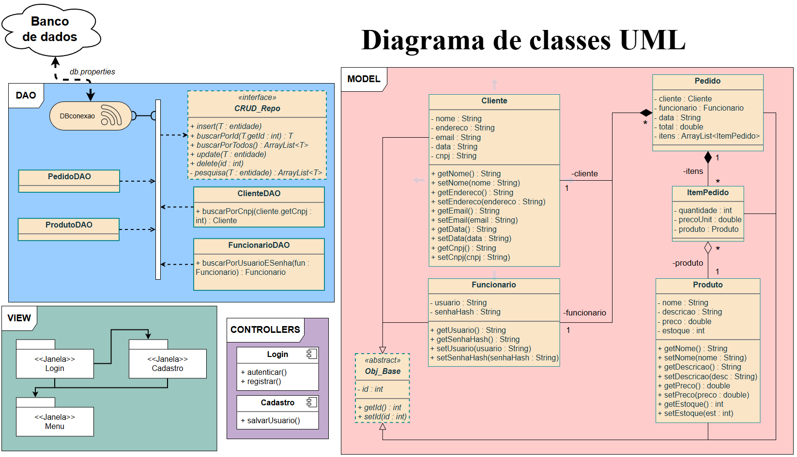

# Sistema desktop de gestão comercial em Java
Aplicação completa desenvolvida em Java (Desktop/Swing/JavaFX) para gerenciamento de um sistema comercial. O programa inclui um módulo de Login e Autenticação de funcionários e funcionalidades CRUD (Creat, Read, Update e Delete) para as entidades principais: Clientes, Produtos e Pedidos. A persistência de dados é realizada via JDBC em um banco de dados SQL.

**English:** Full-stack Java desktop application for business management. Features secure login, CRUD operations for clients, products, and orders, using JDBC and SQL database.

# Diagrama de classes UML

# Aprendizado
Com este projeto, busco aprender sobre:
- SQL.
- Uso do GitHub.

E melhorar meus conhecimentos sobre:
- Java.

# Ferramentas
- Apache NetBeans IDE 28.
- PostgreSQL.
- Draw io.
- Banco de dados gratuito da Neon (simulando um servidor SQL).

# Material de apoio utilizado
- [Playlist sobre banco de dados em Java](https://youtube.com/playlist?list=PLJIP7GdByOyvpQ7EbzucVHocSAG7_EZQZ&si=B3FHyun_juGUvA1D)

# Roadmap
- [x] Fazer sistema de login
	- [x] Fazer a conexão com o banco de dados
	- [x] Fazer o DAO
	- [x] Organizar a janela
	- [x] Montar o controller
- [ ] Fazer a janela menu principal
	- [ ] Fazer a interface do menu
	- [ ] Organizar as funções do menu
	- [ ] Fazer um helper
- [ ] Fazer módulo Cliente
	- [ ] DAO (CRUD compleo)
	- [ ] Janelas de adição/remoção/edição
	- [ ] Controller
- [ ] Fazer módulo Produto
	- [ ] DAO (CRUD compleo)
	- [ ] Janelas de adição/remoção/edição
	- [ ] Controller
- [ ] Fazer módulo Pedido
	- [ ] DAO (CRUD compleo)
	- [ ] Janelas de adição/remoção/edição
	- [ ] Controller
- [ ] Fazer a associação N - N
	- [ ] Programar o ItemPedido
	- [ ] Verificar o funcionamento das classes
- [ ] Polir o código e resolver bugs
- [ ] Concluir o projeto
